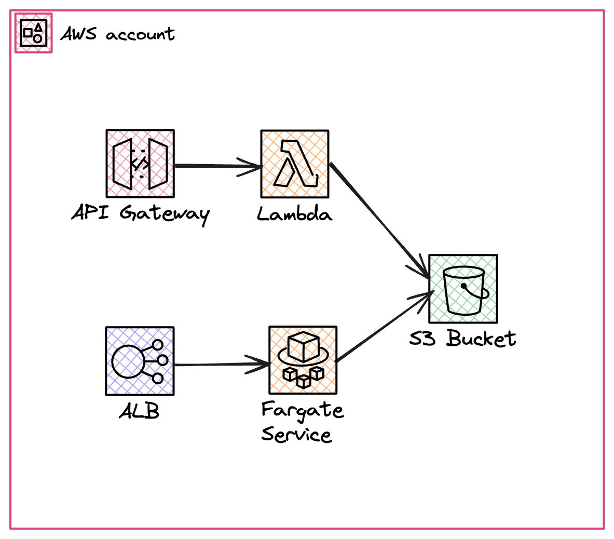
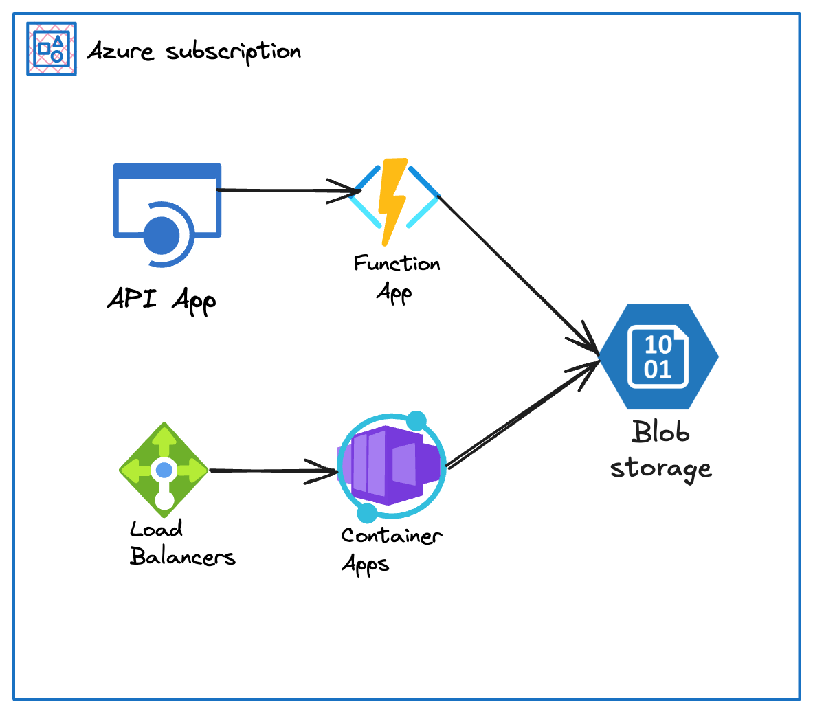

# Multi-cloud native Golang app

This project is a PoC of Multi-cloud application using Cloud native services in both AWS and Azure.

## Description

It tries to demonstrate how easy is to create business logic and separated layers for FaaS and Contaneraized services independenly of the Cloud provider and switch from one to another just changing the related entrypoints/services.

We are going to build something like:

(AWS)



(AZURE)



We will be writing an application that will be serving as an API both in the FaaS and Contanerized worlds that essentially picks the request content and writes a file to a blob storage service.

## Tech stack

- **Infrastructure**: Pulumi
- Application **programming language**: Golang
- **AWS services**:
  - API Gateway
  - Lambda
  - S3
  - Application Load Balancer
  - ECS + ECR
- **Azure services**:
  - TBD

## Repository contents

```shell
.
├── infra
│   ├── aws
│   └── azure
└── src
    ├── common
    ├── entrypoints
    │   ├── azure-container
    │   ├── azure-function
    │   ├── ecs-fargate
    │   └── lambda
    └── storage
```

- `infra` folder contains a pulumi project per Cloud provider in their respectives sub-folders that will create the specific resources for each one.
- `src/common` folder contains some common useful code, like constants or common settings
- `src/entrypoints` folder contains the specific Go code that will be picked for each platform (e.g. AWS - Lambda) as the entrypoint of the application. It also provides specific instantiation of specific storage service depending on the Cloud provider
- `src/storage` folder contains the common storage service interface and their specific implementations (e.g. S3)

## Getting started

### Requirements

- AWS account
- Azure account
- [Pulumi](https://www.pulumi.com/docs/)
- [Go](https://go.dev/)
